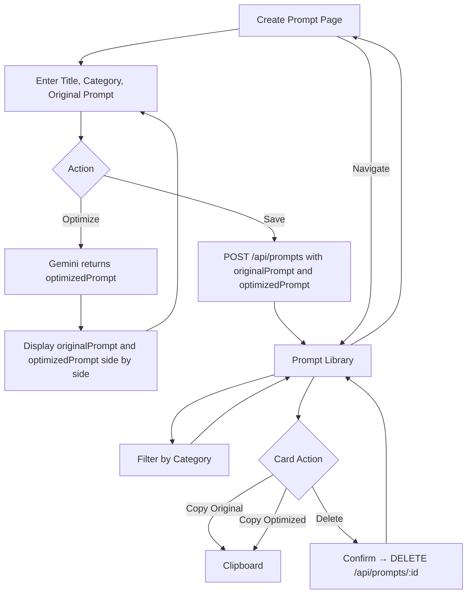

# Product Requirements Document (PRD)

**Product:** PromptCraft AI – AI Prompt Engineering & Optimization Platform  
**Version:** 1.2 (MVP – Final)  
**Status:** Approved  
**Last Updated:** June 21, 2026

---

## 1. Executive Summary

PromptCraft AI is a lightweight web application that helps users write better AI prompts, save them locally, and reuse them across projects. Users draft a prompt, optimize it with Google Gemini, save both the original and optimized versions to a prompt library, and manage entries by category—all without accounts or a database.

The MVP is scoped for an internship-ready portfolio: React + Flask + JSON file storage, no authentication, and no editing or detail views. The focus is a clear create → optimize → save → library workflow.

---

## 2. Problem Statement

Many people use AI tools daily but struggle to write effective prompts. Common issues include vague instructions, no place to store prompts that worked, and time spent rewriting the same prompts.

PromptCraft AI addresses this with a simple tool that combines prompt creation, AI-powered optimization, and local organization—without signup, databases, or complex tooling.

---

## 3. Project Objectives


| Objective                       | Description                                                              |
| ------------------------------- | ------------------------------------------------------------------------ |
| **Enable prompt creation**      | Let users write prompts with title, category, and original content       |
| **Improve prompt quality**      | Use Gemini to suggest optimized prompt text                              |
| **Support reuse**               | Save, browse, copy, and delete prompts (original and optimized versions) |
| **Enable organization**         | Categorize and filter prompts in the library                             |
| **Demonstrate technical skill** | Deliver a working full-stack portfolio project                           |
| **Ship simply**                 | MVP with minimal architecture and no auth/database                       |


---

## 4. Target Users


| Persona              | Primary use                                   |
| -------------------- | --------------------------------------------- |
| **Students**         | Study aids, essay prompts, research questions |
| **Content creators** | Posts, outlines, caption templates            |
| **Developers**       | Code review, debugging, documentation prompts |
| **AI tool users**    | Reusable prompt templates                     |
| **Prompt engineers** | Quick iteration and library management        |


---

## 5. User Stories


| ID    | As a… | I want to…                                                 | So that…                                     |
| ----- | ----- | ---------------------------------------------------------- | -------------------------------------------- |
| US-01 | User  | Create a prompt with title, category, and original content | I can capture a new idea                     |
| US-02 | User  | Optimize my prompt with Gemini                             | I get clearer, more effective wording        |
| US-03 | User  | Save both my original and optimized prompts to my library  | I can compare and reuse either version later |
| US-04 | User  | View all saved prompts in one place                        | I can browse my collection                   |
| US-05 | User  | Copy a prompt from the library                             | I can paste it into any AI tool              |
| US-06 | User  | Delete a prompt I no longer need                           | My library stays relevant                    |
| US-07 | User  | Filter prompts by category                                 | I can find prompts by topic quickly          |
| US-08 | User  | See loading and error states during optimize/save          | I know when the app is working or failed     |


---

## 6. Functional Requirements

### 6.1 Create Prompt

- **FR-01:** Provide inputs for **title** (required), **category** (required), and **original prompt** content (required).
- **FR-02:** Validate title, category, and original prompt before optimize or save.
- **FR-03:** No tags, notes, or other metadata fields.

### 6.2 Optimize Prompt

- **FR-04:** "Optimize" sends `originalPrompt` text to `POST /api/optimize`; backend calls Gemini API.
- **FR-05:** Display optimized text separately from the original in the create view so the user can compare both before saving.
- **FR-06:** On API failure, show a clear error; do not clear user input.
- **FR-07:** Optimizing does not auto-save; user must explicitly save.

### 6.3 Save Prompt

- **FR-08:** "Save" sends title, category, `originalPrompt`, and `optimizedPrompt` to `POST /api/prompts`.
- **FR-09:** Each saved record includes: `id`, `title`, `category`, `originalPrompt`, `optimizedPrompt`, `createdAt`.
- **FR-10:** If the user saves without optimizing, `optimizedPrompt` is stored as an empty string.
- **FR-11:** Show confirmation on successful save.
- **FR-12:** Saved prompts cannot be updated. To change a prompt, user creates and saves a new one (and may delete the old one).

### 6.4 View Prompt Library

- **FR-13:** `GET /api/prompts` loads all saved prompts on the library view.
- **FR-14:** Each prompt card/list item displays title, category, `originalPrompt`, `optimizedPrompt` (if present), and date so users can compare versions directly.
- **FR-15:** No separate detail page or drill-down view.
- **FR-16:** Empty state with CTA to create a prompt when library is empty.

### 6.5 Copy Prompt

- **FR-17:** Each library card provides separate Copy actions for `originalPrompt` and `optimizedPrompt` (optimized copy disabled or hidden when `optimizedPrompt` is empty).
- **FR-18:** Brief confirmation after copy (e.g., "Copied!").

### 6.6 Delete Prompt

- **FR-19:** "Delete" on each library card calls `DELETE /api/prompts/:id` after confirmation.
- **FR-20:** Library refreshes after deletion.

### 6.7 Categorize Prompts

- **FR-21:** User selects a category when creating/saving.
- **FR-22:** Library supports filter by category.
- **FR-23:** Default categories: General, Writing, Coding, Study, Marketing, Other.

### 6.8 API Design


| Method | Endpoint           | Purpose                                                                       |
| ------ | ------------------ | ----------------------------------------------------------------------------- |
| POST   | `/api/optimize`    | Accept `originalPrompt` text; return `optimizedPrompt` text from Gemini       |
| POST   | `/api/prompts`     | Save new prompt with `title`, `category`, `originalPrompt`, `optimizedPrompt` |
| GET    | `/api/prompts`     | List all prompts including both prompt fields                                 |
| DELETE | `/api/prompts/:id` | Delete prompt by ID                                                           |


- **FR-24:** No GET-by-id, PUT, or PATCH endpoints.
- **FR-25:** Prompts persisted in a single JSON file (e.g., `prompts.json`).
- **FR-26:** Gemini API key stored server-side only (environment variable).

---

## 7. Non-Functional Requirements


| Category             | Requirement                                                                 |
| -------------------- | --------------------------------------------------------------------------- |
| **Performance**      | Library load and save under ~2s locally; optimize latency depends on Gemini |
| **Usability**        | Simple, clean UI; works on desktop and tablet                               |
| **Reliability**      | Graceful API error handling; no data loss on failed save                    |
| **Security**         | API keys server-side only; basic input validation; CORS for dev             |
| **Maintainability**  | Plain React (JS) + Flask; minimal dependencies                              |
| **Portability**      | Runs locally with Node, Python, and env file                                |
| **State management** | Local React component state only (`useState`, etc.)                         |


---

## 8. System Architecture

```
┌─────────────────────────────────────────────────────────┐
│                    React Frontend                        │
│  (JavaScript + CSS, local component state)               │
│                                                          │
│  ┌──────────────────┐    ┌──────────────────────────┐   │
│  │  Create Prompt   │    │     Prompt Library       │   │
│  │  Page            │    │     Page                 │   │
│  └────────┬─────────┘    └────────────┬─────────────┘   │
└───────────┼───────────────────────────┼─────────────────┘
            │         REST API          │
┌───────────▼───────────────────────────▼─────────────────┐
│                    Flask Backend                         │
│                                                          │
│  POST /api/optimize  ──►  Gemini API                    │
│  POST /api/prompts   ──►  prompts.json                  │
│  GET  /api/prompts   ◄──  prompts.json                  │
│  DELETE /api/prompts/:id ──► prompts.json               │
└─────────────────────────────────────────────────────────┘
```


| Layer        | Technology                 | Notes                                           |
| ------------ | -------------------------- | ----------------------------------------------- |
| **Frontend** | React, JavaScript, CSS     | Two views; no TypeScript, Redux, or Context API |
| **Backend**  | Flask, Python              | Four REST endpoints only                        |
| **AI**       | Google Gemini API          | Server-side integration; key via env variable   |
| **Storage**  | JSON file (`prompts.json`) | No database; single-user local persistence      |


---

## 9. User Flow




**Primary happy path:** Enter title, category, and original prompt → Optimize → Compare original and optimized → Save both → Open library → Copy either version into an external AI tool.

**Note:** There is no edit flow. Changes require creating a new prompt and optionally deleting the old one.

---

## 10. MVP Scope

### In Scope

- React frontend (JavaScript + CSS)
- Flask backend with Gemini integration
- JSON file storage
- Two views: **Create Prompt** and **Prompt Library**
- Seven core features: Create, Optimize, Save, View Library, Copy, Delete, Categorize
- Category filter in library
- Loading and error states for optimize, save, and delete
- README with setup instructions

### Data Model

```json
{
  "prompts": [
    {
      "id": "uuid",
      "title": "string",
      "category": "string",
      "originalPrompt": "string",
      "optimizedPrompt": "string",
      "createdAt": "ISO8601"
    }
  ]
}
```

### Frontend Structure (Suggested)

- **Create Prompt page** – form (title, category, original prompt), Optimize and Save buttons; displays both `originalPrompt` and `optimizedPrompt` after optimization
- **Prompt Library page** – category filter, prompt cards showing both versions with Copy (original), Copy (optimized), and Delete

---

## 11. Out of Scope Features


| Feature                             | Reason                                                |
| ----------------------------------- | ----------------------------------------------------- |
| Edit / update saved prompts         | Simplifies MVP; create new + delete instead           |
| Prompt detail page                  | Library cards show full content                       |
| Tags, notes, extra metadata         | Only title, category, originalPrompt, optimizedPrompt |
| GET /api/prompts/:id, PUT, PATCH    | Not needed for simplified CRUD                        |
| User authentication & accounts      | MVP constraint                                        |
| Database                            | JSON file only                                        |
| Docker                              | Explicitly excluded                                   |
| TypeScript                          | JavaScript only                                       |
| Global state (Redux, Context, etc.) | Local component state only                            |
| Prompt versioning / history         | Future enhancement                                    |
| Export/import                       | Future enhancement                                    |
| Multiple AI providers               | Gemini only                                           |
| Payment, analytics, mobile app      | Not applicable for MVP                                |


---

## 12. Success Criteria

### Product

- [ ] User can create, optimize, save, view, copy, delete, and filter by category end-to-end
- [ ] Both `originalPrompt` and `optimizedPrompt` are stored on save and visible in the library for comparison
- [ ] User can copy either the original or optimized version from the library
- [ ] Library shows full prompt content on cards (no detail page)
- [ ] Saved prompts persist across restarts via JSON file
- [ ] No edit or update paths exist in UI or API

### Portfolio

- [ ] Clear local run instructions in README
- [ ] UI communicates purpose within seconds
- [ ] Demonstrates React, Flask REST API, and Gemini integration
- [ ] Completable in ~2–4 weeks part-time

### Technical

- [ ] Only four API endpoints implemented
- [ ] Gemini API key not exposed to frontend or repo
- [ ] Empty, loading, and error states handled

---

## 13. Future Enhancements


| Priority | Enhancement                   |
| -------- | ----------------------------- |
| P1       | Export/import library (JSON)  |
| P1       | Starter prompt templates      |
| P2       | Edit saved prompts            |
| P2       | Search by title               |
| P2       | Custom category management    |
| P3       | User accounts + cloud storage |
| P3       | Additional AI providers       |
| P3       | Dark mode                     |


---

## Appendix: Assumptions

- Single-user, local or simple hosted demo
- Valid Gemini API key available
- JSON file sufficient for read/write without concurrent multi-user access
- Categories chosen from fixed list at save time

---

## Revision History


| Version | Date          | Status       | Summary                                                                               |
| ------- | ------------- | ------------ | ------------------------------------------------------------------------------------- |
| 1.0     | June 21, 2026 | Superseded   | Initial draft with full CRUD, edit flow, and single `prompt` field                    |
| 1.1     | June 21, 2026 | Superseded   | Simplified scope: no edit, no detail page, four API endpoints, local state only       |
| 1.2     | June 21, 2026 | **Approved** | Dual-field data model (`originalPrompt` + `optimizedPrompt`) for comparison and reuse |


